# Reconfigurable Switch on FPGA

## Primitive

General primitive format (64 bits)

```
 63         58 57       32 31              16 15               0
+-------------+-----------+------------------+------------------+
| op code (6) | misc (26) | field spec1 (16) | field spec2 (16) |
+-------------+-----------+------------------+------------------+
```

Field Spec (16 bits)

```
 15        12 11        6 5       0
+------------+-----------+---------+
| hdr id (4) | start (6) | len (6) |
+------------+-----------+---------+
```

No op

```
 63        58 57        0
+------------+-----------+
| 000000 (6) | zero (58) |
+------------+-----------+
```

Checksum

```
 63        58 57           54 53           32 31              16 15             0
+------------+---------------+---------------+------------------+----------------+
| 000001 (6) | hash type (4) | reserved (22) | cksum field (16) | dst field (16) |
+------------+---------------+---------------+------------------+----------------+
hash type (4)
0000: CKSUM16
```

Add

```
 63        58 57        32 31        16 15            0
+------------+------------+------------+---------------+
| 000010 (6) | delta (26) | field (16) | reserved (16) |
+------------+------------+------------+---------------+
```

Copy field

```
 63        58 57           32 31            16 15             0
+------------+---------------+----------------+----------------+
| 000011 (6) | reserved (26) | dst field (16) | src field (16) |
+------------+---------------+----------------+----------------+
```

Set port

```
 63        58 57           32 31           16 15            0
+------------+---------------+---------------+----------------+
| 000100 (6) | reserved (22) | reserved (16) | src field (16) |
+------------+---------------+---------------+----------------+
```

Set multicast

```
 63        58 57            0
+------------+---------------+
| 000101 (6) | reserved (58) |
+------------+---------------+
```

Recirculate

```
 63        58 57            0
+------------+---------------+
| 000110 (6) | reserved (58) |
+------------+---------------+
```

Push Tag

```
 63        58 57                       26 25                 22 21            0
+------------+---------------------------+---------------------+---------------+
| 001000 (6) | generated header loc (32) | front header id (4) | reserved (22) |
+------------+---------------------------+---------------------+---------------+
take MPLS or my_tunnel as examples
```

Pop Tag

```
 63        58 57           54 53            0
+------------+---------------+---------------+
| 001001 (6) | header_id (4) | reserved (54) |
+------------+---------------+---------------+
```

## Ablation Study

Fixed Processors

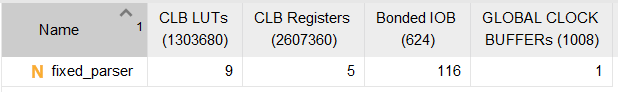

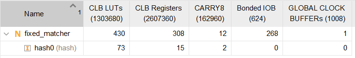

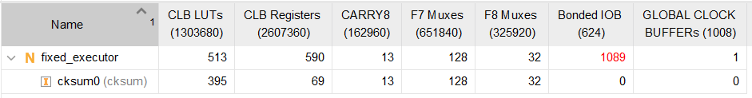

Fixed Processor v2

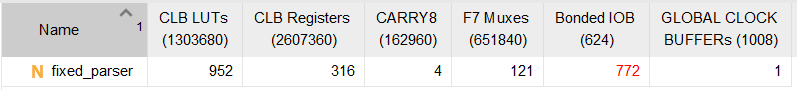

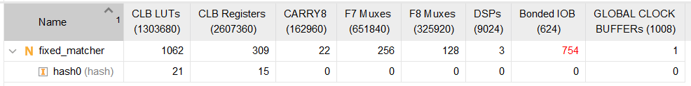

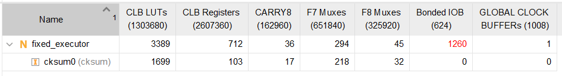

Reconfigurable Processors

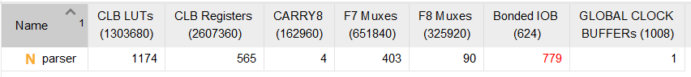

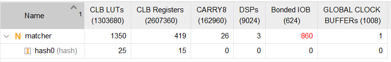

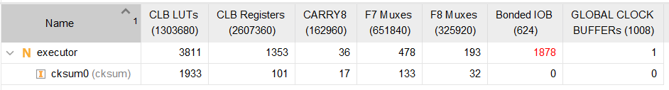

Switch

4 processors

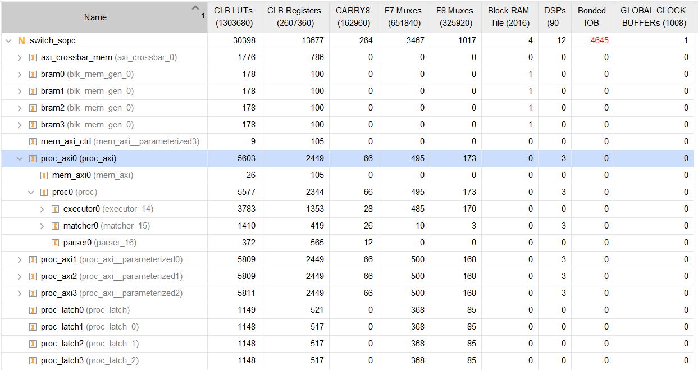

3 processors

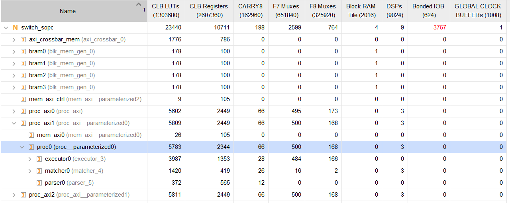

2 processors

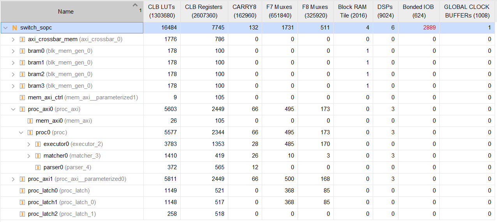

1 processor

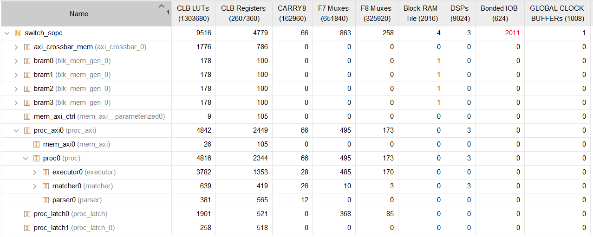

Fixed Switch

4 proc

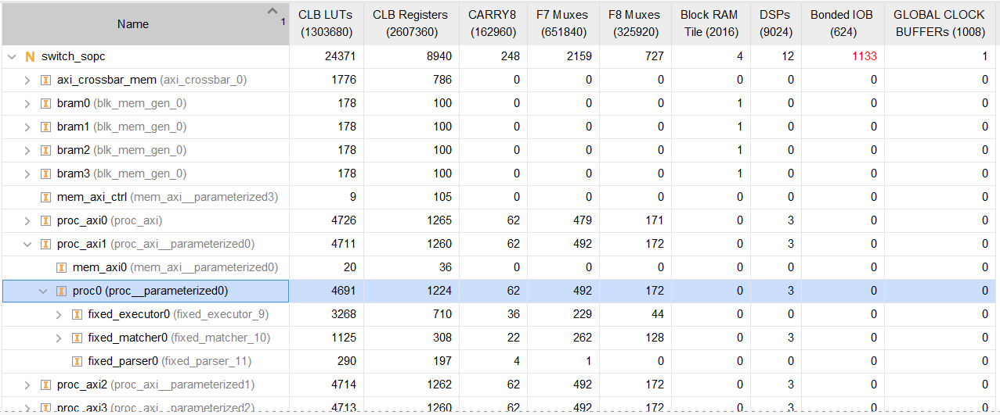

3 proc

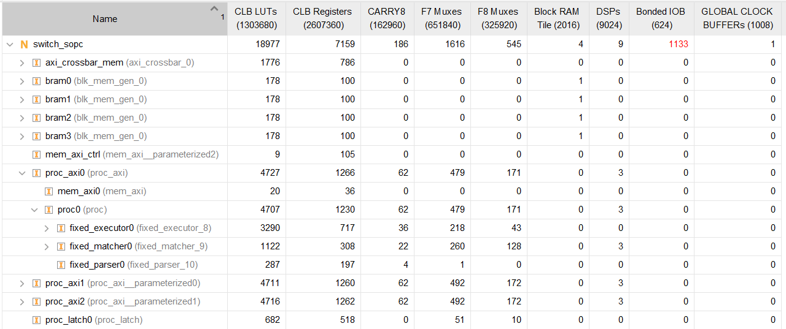

2 proc

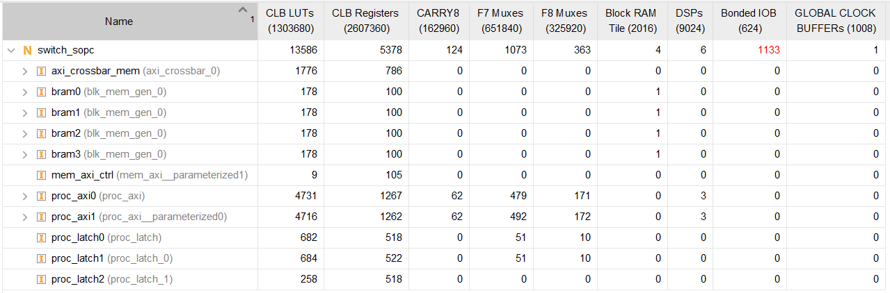

1 proc

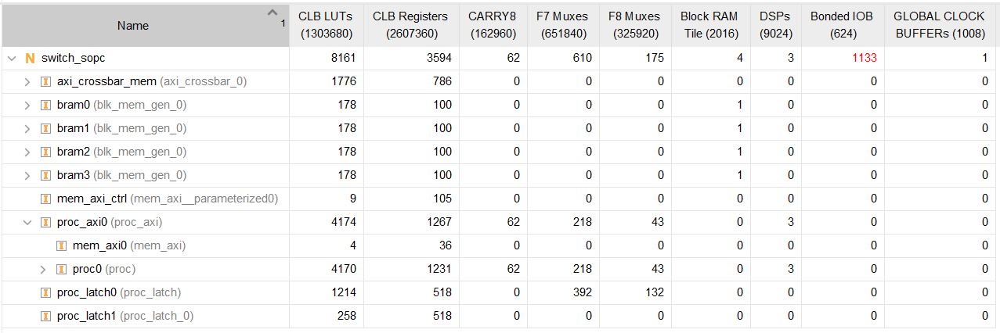
